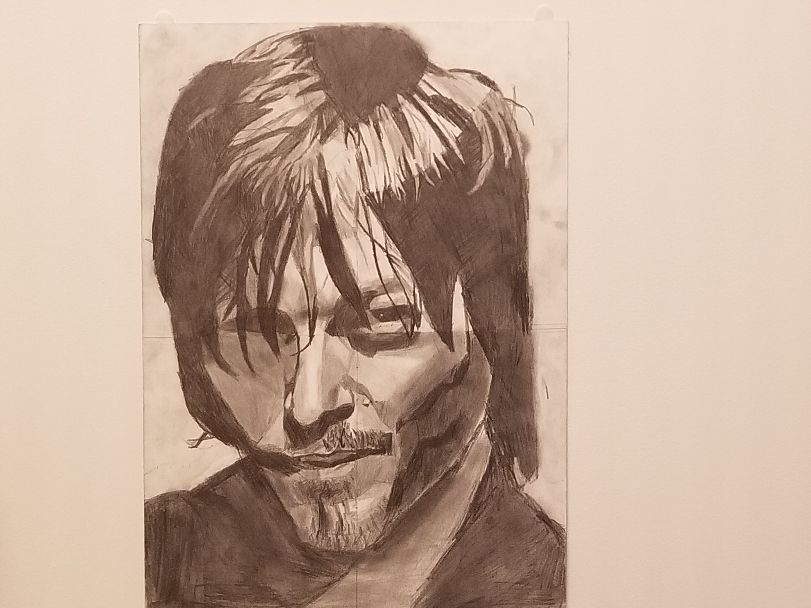
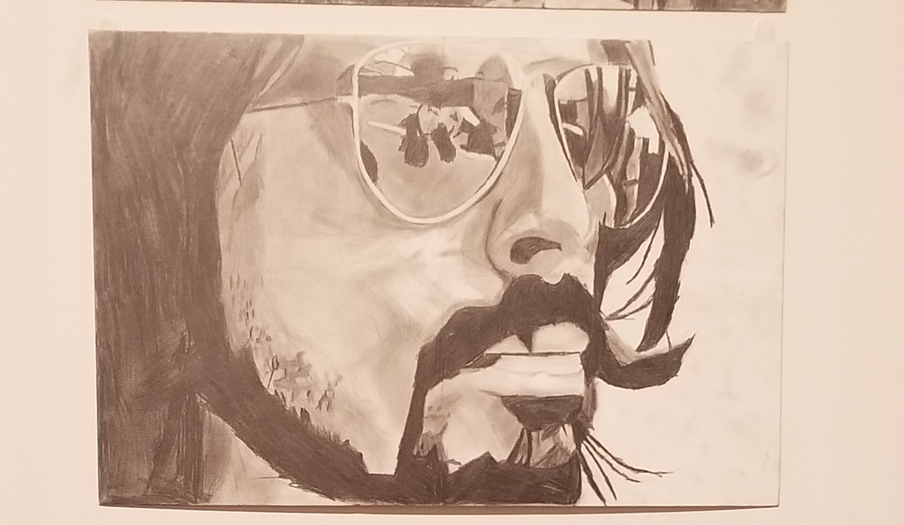

## Welcome to GitHub Pages

You can use the [editor on GitHub](https://github.com/NickyV1234/cool/edit/master/docs/index.md) to maintain and preview the content for your website in Markdown files. no you cant lol

Whenever you commit to this repository, GitHub Pages will run [Jekyll](https://jekyllrb.com/) to rebuild the pages in your site, from the content in your Markdown files.

### Markdown

Markdown is a lightweight and easy-to-use syntax for styling your writing. It includes conventions for

```markdown
Syntax highlighted code block

# yeah dude lets see what happens
## Header 2
### Header 3

- Bulleted
- List

1. Numbered
2. List

**Bold** and _Italic_ and `Code` text

[Link](url) and 
```

For more details see [GitHub Flavored Markdown](https://guides.github.com/features/mastering-markdown/).

### Jekyll Themes

Your Pages site will use the layout and styles from the Jekyll theme you have selected in your [repository settings](https://github.com/NickyV1234/cool/settings). The name of this theme is saved in the Jekyll `_config.yml` configuration file.

### Support or Contact

Having trouble with Pages? Check out our [documentation](https://docs.github.com/categories/github-pages-basics/) or [contact support](https://github.com/contact) and we’ll help you sort it out.

here is my digital art project that i worked on. its pretty cool go check it out!
<iframe width="560" height="315" src="https://www.youtube.com/embed/apmvGn8XNLM" frameborder="0" allow="accelerometer; autoplay; clipboard-write; encrypted-media; gyroscope; picture-in-picture" allowfullscreen></iframe>

# MY WORK EXPERIENCE
Nicholas Versagli
Email: npv4@psu.edu

Phone (Cell): (484) 356-3878
112 ellicott rd avondale PA
Postal code: 19311

Education
Pennsylvania State University Brandywine 
25 Yearsley Mill Rd Middletown PA
Intended major: Astrophysics
Classes attended so far: Chemistry 110, HDFS - 287Y, Social Psychology, Math 41

General Qualifications
I consider myself to have a creative mind with the capacity to juggle many tasks at once. I have exceptional schedule building and organizing skills so that I can help get through my day and decide what I will accomplish at the end of the day. I also work well with others and am willing to work in groups and teams to accomplish a specific task. I am a quick learner and can adjust easily to new scenarios and environments.

Volunteer work
Annual Mushroom Festival 
Kennet Square PA 
Postal code: 19350
Supervisor Hilary M fox (302) 555-5555
Assistant for kennett mushroom festival every year since 2013
Work description: I was required to help fill out order forms for mushrooms that people wished to purchase, help set up tents and presentations on mycology, and do quick mental math to calculate the total price of customer’s orders. Total accumulated hours of volunteer work: 20.

Activities participated in
I have participated in a local tree planting event where A group of people and I would plant young tree saplings in designated spots so that they could grow up eventually.

Employment
Hockessin Acme deli
128 Lantana Dr. Hockessin De
Postal code: 19707
(302) 234-9000
Job description: Every friday and at the weekends I work in the deli department at the Acme in Hockessin DE. Here I slice meats and cheeses that customers will request. Part of being a good deli worker is having a good sense of on the fly guessing of how much something weighs and being quick and efficient with potentially dangerous machinery.
Painters crossing
800 bldg painters crossing Chadds ford PA
(710) 762-7460
Job description: Helped maintain decks and trimmed windows. Taking down plywood exterior for decks and putting on a hardy plank exterior. Made precise cuts for Azek to trim for windows. Operated several power tools including nail gun, table saw, chop saw, hand saw… etc.  

# MY ART EXPERIENCE 
ever since i was in highschool I have been working on tuning my skill with art that I have had ever since I was young. I took numorous art classes in highschool as well as in college. My strong suit with physical art definitely comes from my ability to work with graphite. here are some of the images I have drawn with it
# Graphite Drawings
## This is a portrait i did of my two most favorite characters from the walking dead!


## Here is a graphite drawing of Dave Grohl lead singer of Foo Fighters

