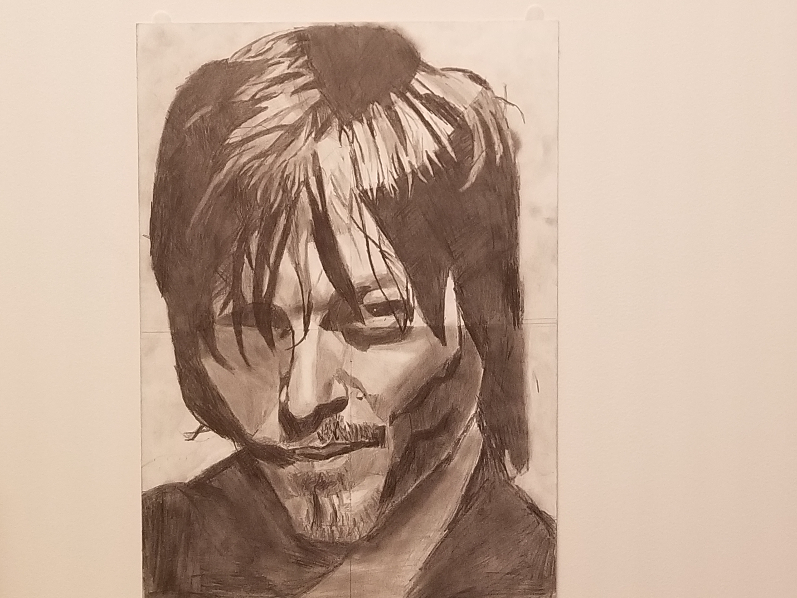

# MY ART EXPERIENCE 
ever since i was in highschool I have been working on tuning my skill with art that I have had ever since I was young. I took numorous art classes in highschool as well as in college. My strong suit with physical art definitely comes from my ability to work with graphite. here are some of the images I have drawn with it

# Graphite Drawings
## This is a portrait i did of my two most favorite characters from the walking dead!

## Here is a graphite drawing of Dave Grohl lead singer of Foo Fighters

# DITITAL ART
I one day to use my skills to work on designing video games. To show how dedicated I am to this I am currently in the process of drawing art for my favorite video game "titanfall 2" designed by respawn entertainment who is the video game producer who I wish to work for. 
## here are some drawings of in game female models I did 

## male in game model escaping battlefield
.jpg)

    

pages < [1](index.md) , [2](index2.md) , [3](index3.md) , [4](index4.md) >

