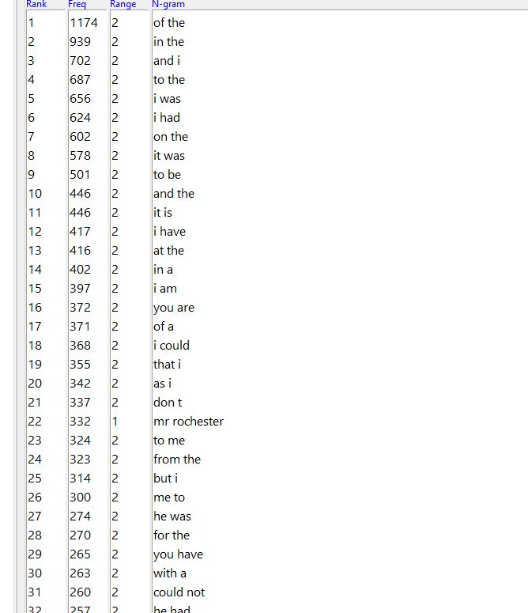
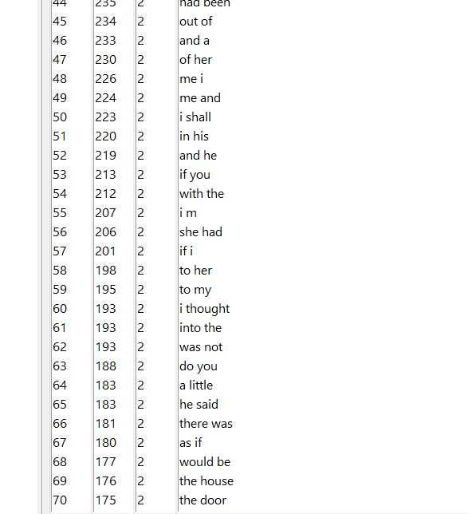
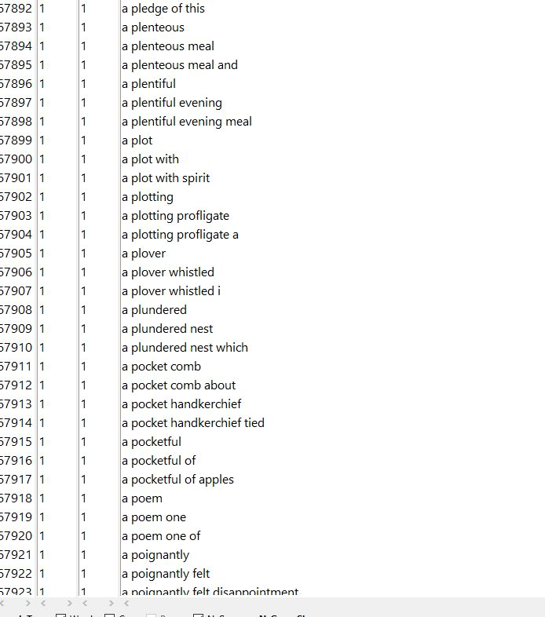
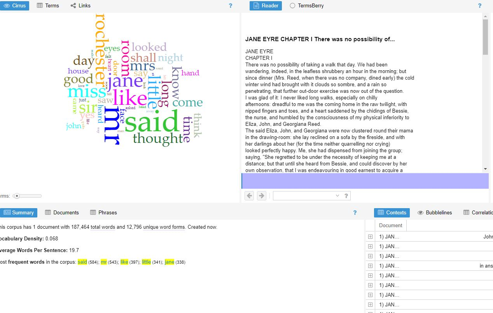
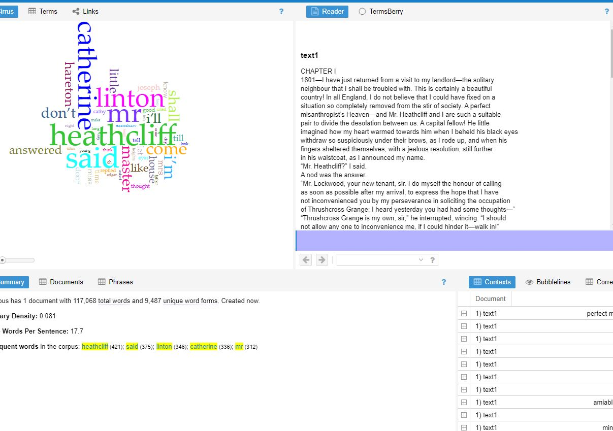
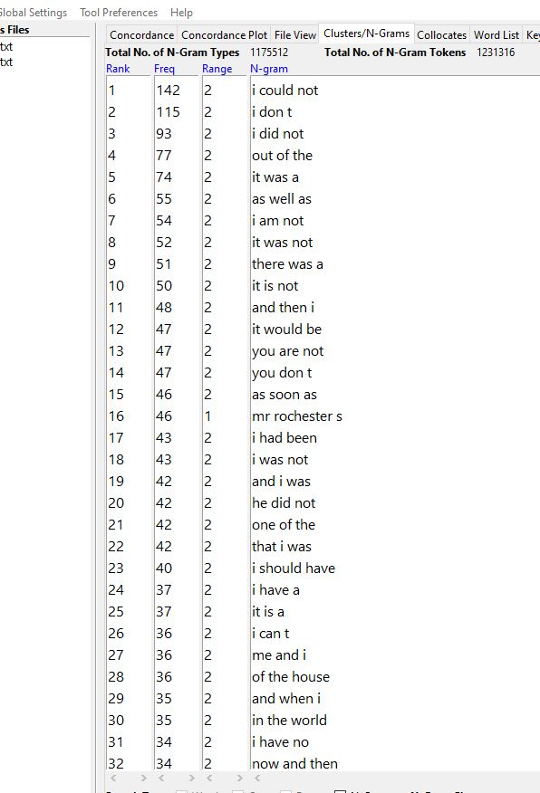

 

The two texts that I analyzed were Charlotte Brontë, Jane Eyre and Emily Brontë, Wuthering Heights. these are screenshots of the antconc tool. As for the settings I set it to clusters and ngrams with a min of 2 and a max of 4. So the first conclusion that I came to when analyzing these two texts is that they really dont have that many specific phrases in common. the only phrases both passages have are very common and run of the mill comnbinations of words. But the very frequent phrases that both of the stories held were very intensive with third person and first person words "you, I, me, Him, Her, and he" in particular. I found this to be very interesting. But as for the rest of the phrases. that ant conc was able to find, they were phrases that only belonged to one article.
 
here is the voyant tools analysis of Jane eyre. it has a total of 187,000 words. Im not suprised at this due to the fact that most of the phrases that have a range of 1 are from Jane eyre.

here is the voyant tools analysis of wuthering heights. This of course has 117,000 words. there for it makes sense that it doesnt not have as many phrases that have a range of one from the antconc analysis.

here is another antconc analysis. I decided to increase min range to 3 and max range to 6. And of course I was not suprised when it turns out that the number of phrases that had a range of 2 became smaller than when the min was 2 and max was 4
