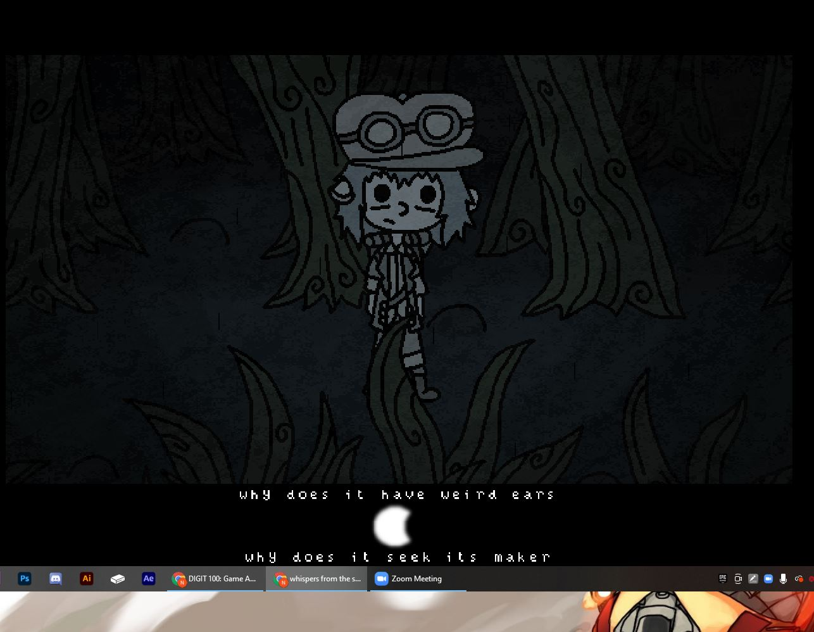

For this project my main game that I looked into playing was a game called "whispers from the sky" and the secondary game was called
"zordak" 
As for "whispers of the wind", it appears to be about a young female protagonist who has gotten lost in the woods and has the goal of getting to the moon
you play the role of "the wind" which she claims is whispering to her. The art is cartoon style and is 2 dimensional. In regards to complexity although you are limited in where your 
character can go. there are set path options for you to take. it doesnt really feel like a game and more so like a story that you can interact with loosely. Throughout the game you get 
to meet a whole bunch of fairy tale like creatures. each of them with their own set of personalities. in my limited time playing the game I came across a pond creature who was very 
social and wanted to be friends, a cave creature who was friendly but was mostly oblivious to the outside world, and a creature who makes piles of rocks who also wishes to go to the moon
for the purpose of getting new friends. 
here is the female protagonist who you travel with
 
as you can see wiht this screen shot you are given dialogue options 
 
so overall The game didnt really stand out to my. I have never really been a fan of games that are really just stories that you follow along with. Now a game doesnt have to have shooting and violence to be fun but a game needs to have alot more freedom than just loosely being able to follow a storie with no real challenges. From the brief amount that i played there were no challenges for me to complete, not even puzzles, there should at least been the ability to move the character around freely with controls. as for the mechanics, well there really arent that many, just scripted lines designed to go off when you choose particular options. as for how the game performs, i was getting pretty good framerate. but when i got to the point in the story where the protagonist reaches a man in the forest who is selling apparell, the game freezes soon after and the screen just goes completely blank. not really sure why this happens or if it supposed to happen in the first place. but yet over all I was not really impressed with the game.
now onto "zordak" i didnt really go too in depth into this game but here is what i came up with 
he game appears to be your typical 64 bit game graphics, of course with that came along the platformer game style.
Because this was only a demo the amount that I could explore was actually extremely limited. I dont know if i missed something or what but there is barely 5 minutes worth of exploring that you can do before you reach the limits of the demo.
You dont really get to know the female protagonist of the story, all you really know about her is that she is a space agent of sorts. This is revealed through text dialog in the beginning
There really are no npc characters in this story.
The game heavily relies on you being able to figure things out for yourself. There really are no tips on what you can do. All you are really given is a map. And control tips.
There are save checkpoints and doors that you can interact with in the demo
The game from what i saw was extremely limited and so subliminal commentary or higher meaning becomes too vague and non existent for the most part.
