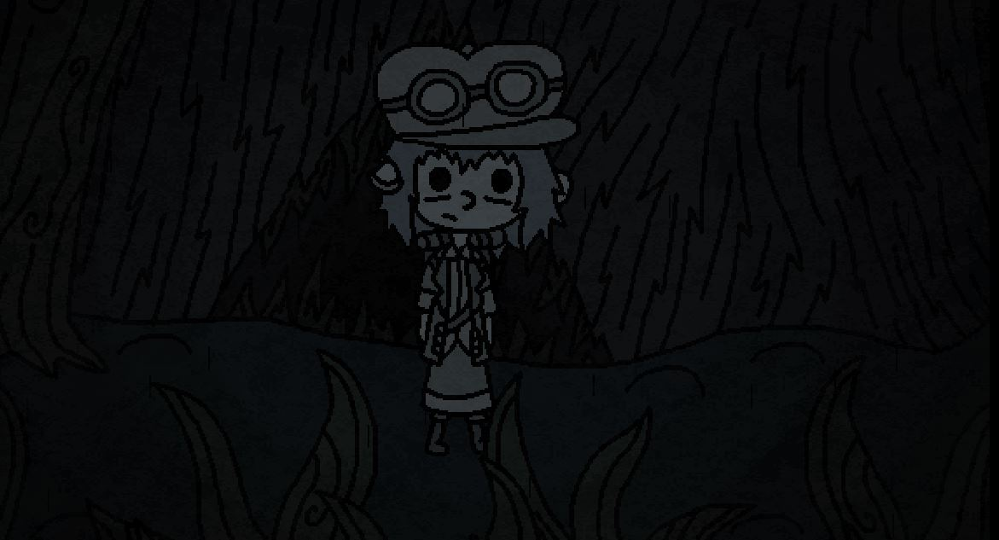

For this project my main game that I looked into playing was a game called "whispers from the sky" and the secondary game was called
"zordak" 
As for "whispers of the wind", it appears to be about a young female protagonist who has gotten lost in the woods and has the goal of getting to the moon
you play the role of "the wind" which she claims is whispering to her. The art is cartoon style and is 2 dimensional. In regards to complexity although you are limited in where your 
character can go. there are set path options for you to take. it doesnt really feel like a game and more so like a story that you can interact with loosely. Throughout the game you get 
to meet a whole bunch of fairy tale like creatures. each of them with their own set of personalities. in my limited time playing the game I came across a pond creature who was very 
social and wanted to be friends, a cave creature who was friendly but was mostly oblivious to the outside world, and a creature who makes piles of rocks who also wishes to go to the moon
for the purpose of getting new friends. 
 
